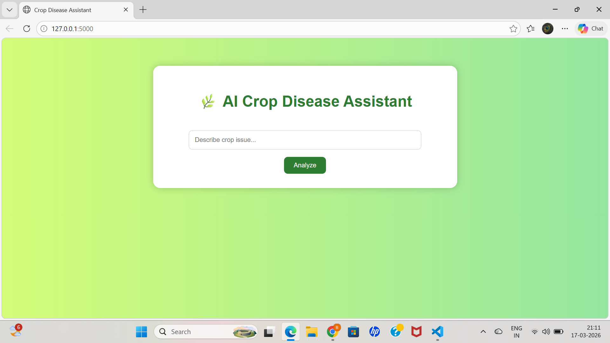
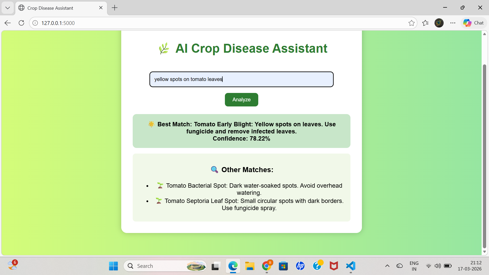

# 🌿 AI Crop Disease Assistant (Semantic Search with Endee Concept)

## 📌 Overview

The **AI Crop Disease Assistant** is a web-based intelligent system that helps identify plant diseases based on user-described symptoms.

It uses **semantic search and vector embeddings** to retrieve the most relevant disease information, inspired by modern vector databases like Endee.

---

## 🚀 Key Features

* 🔎 Semantic search (understands meaning, not just keywords)
* 🧠 AI-based retrieval using embeddings
* 🌿 Crop disease diagnosis suggestions
* 📊 Confidence scoring for predictions
* 🔍 Top-k result ranking
* 🌐 Interactive web interface (Flask)

---

## 🧠 System Architecture

User Input
↓
Embedding Model (Sentence Transformers)
↓
Vector Representation
↓
Similarity Search (Vector Comparison)
↓
Top Matching Results
↓
Display with Confidence Score

---

## ⚙️ Technologies Used

* Python
* Flask
* Sentence Transformers
* NumPy

---

## 📊 Endee Vector Database Concept

This project demonstrates the working principle of **vector databases like Endee**:

* Data is converted into **high-dimensional embeddings**
* Similarity search is used to retrieve relevant information
* Results are ranked based on similarity score

Although Endee itself is a C++-based system, this project implements its **core concept of vector similarity search**.

---

## 🧪 Example

**Input:**

```
yellow spots on tomato leaves
```

**Output:**

* 🌟 Best Match: Tomato Early Blight
* 📊 Confidence: ~70%
* 🔍 Other Matches displayed

---

## 📂 Project Structure

```
my-ai-project/
   app.py
   dataset.txt
   requirements.txt
   README.md
   templates/
       index.html
```

---

## ▶️ How to Run

```
pip install -r requirements.txt
python app.py
```

Open:
http://127.0.0.1:5000

---

## 📸 Project UI


## 📸 Example Output


## ⚠️ Limitations

* Limited dataset (demo purpose)
* Depends on quality of user input
* Not a replacement for expert diagnosis

---

## 🔮 Future Enhancements

* Image-based disease detection
* Integration with real agricultural APIs
* Full Endee vector DB deployment
* Mobile-friendly UI

---

## 🏆 Conclusion

This project showcases how **semantic search and vector embeddings** can be applied to solve real-world agricultural problems, following principles used in modern AI systems and vector databases like Endee.

---

## 👩‍💻 Author
**Meghana Busetty**

Developed as part of an AI/ML project demonstrating vector search systems.
