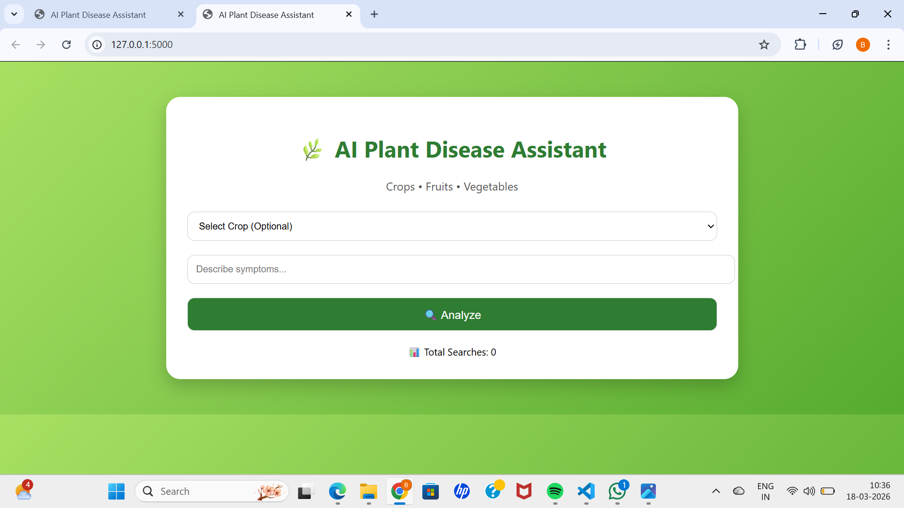

🌿 AI Plant Disease Assistant 

📌 Project Overview

The AI Plant Disease Assistant is a web-based AI application that helps users identify plant diseases based on symptoms.

Users can enter a description of crop issues, and the system returns:

- 🌟 Best matching disease
- 📊 Confidence score
- 🔍 Other similar matches
- 💊 Suggested solutions

This project demonstrates semantic search using vector embeddings, inspired by vector databases like Endee.

---

🚀 Key Features

- 🔎 Semantic Search (meaning-based search)
- 🌾 Supports Crops, Fruits, and Vegetables
- 📊 Confidence Score Visualization (color-based)
- 🧠 Best Match + Alternative Matches
- 🕒 Search History Tracking
- 📈 Analytics (Total Searches)
- 🎨 Attractive UI using HTML & CSS
- ⚡ Fast Flask backend

---

🧠 How It Works

1. User enters symptoms (e.g., "yellow spots on leaves")
2. Input is converted into vector embeddings
3. Dataset is also converted into embeddings
4. Cosine similarity is calculated
5. Best match + similar matches are returned

---

🧩 Tech Stack

- Frontend: HTML, CSS
- Backend: Python (Flask)
- ML Model: Sentence Transformers ("all-MiniLM-L6-v2")
- Concept: Vector Search (Endee-inspired)

---

📂 Project Structure

my-ai-project/
│── app.py
│── dataset.txt
│── requirements.txt
│── README.md
│── templates/
│  └── index.html
│── images/
  ├── ui_screenshot.png
  └── output.png

---

📊 Dataset

- Contains 300+ plant disease entries
- Covers:
  - 🌾 Crops
  - 🍎 Fruits
  - 🥕 Vegetables
- Each entry includes:
  - Disease
  - Symptoms
  - Solution

---

▶️ How to Run

Step 1: Install dependencies

pip install -r requirements.txt

Step 2: Run the app

python app.py

Step 3: Open browser

http://127.0.0.1:5000

---

📸 Project UI

---

📸 Example Output

---

⚠️ Limitations

- Uses demo dataset (not 100% real-world accurate)
- Depends on user input quality
- Not a replacement for expert diagnosis

---

🔮 Future Improvements

- 🌐 Full Endee vector database integration
- 📷 Image-based disease detection
- 🧠 RAG (Retrieval-Augmented Generation)
- 📱 Mobile-friendly UI
- 🌍 Multi-language support

---

🏆 Conclusion

This project shows how semantic search and vector embeddings can be applied to real-world agricultural problems using modern AI techniques.

---

👩‍💻 Author

Meghana Busetty
